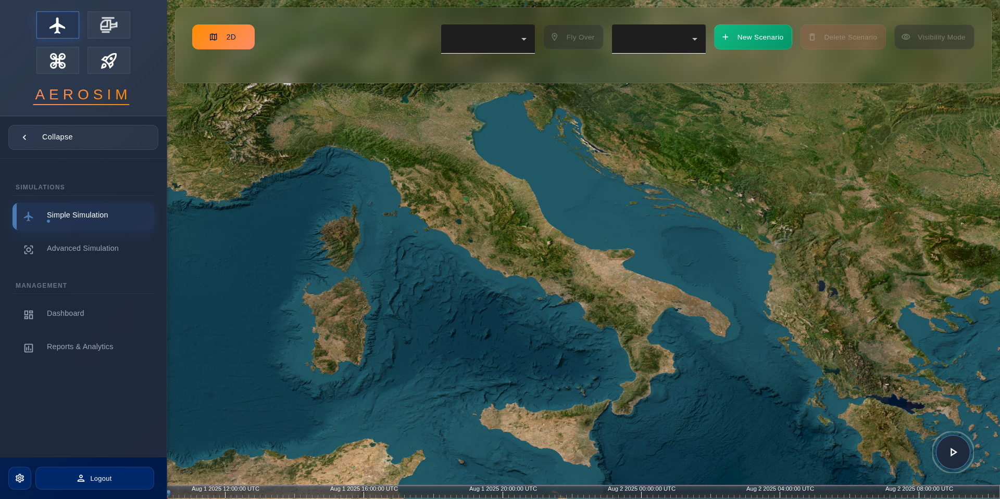
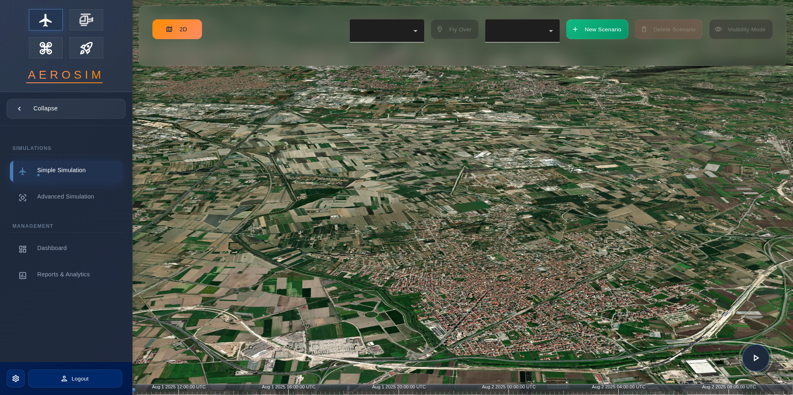
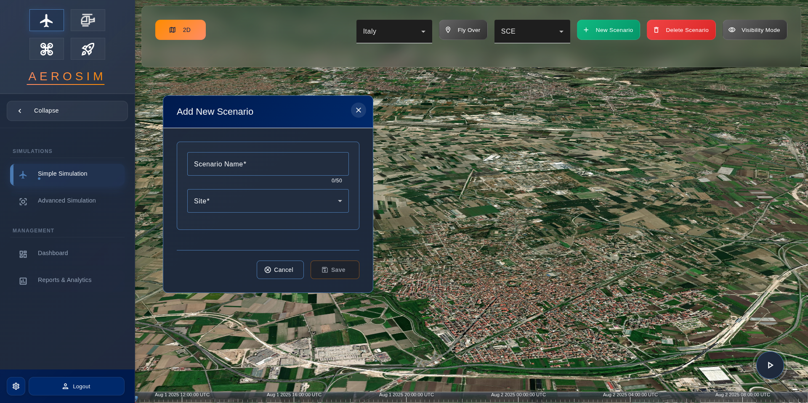
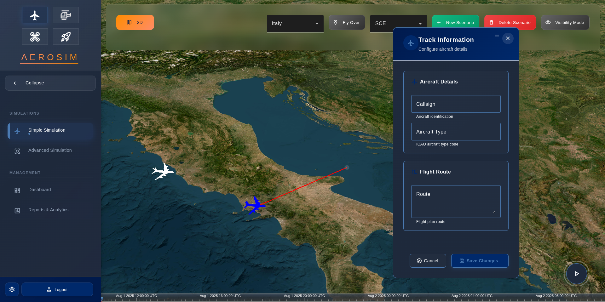
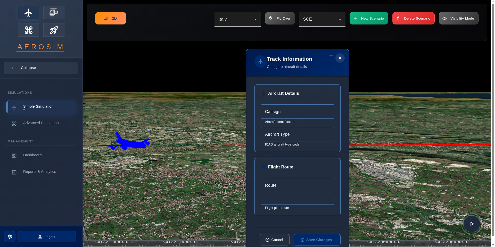
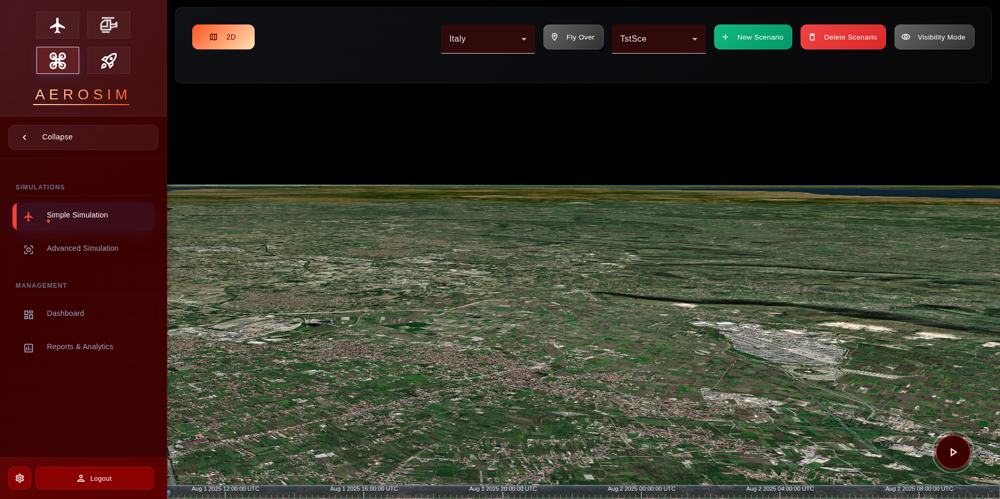

# 🛩️ AeroSim – Web-Based Radar Simulation UI

**AeroSim** is a modern web-based interface that allows users to configure, launch, and visualize simulated air traffic scenarios with realistic radar behavior. It is the human-machine interface (HMI) for the **Track Lookup** C++ radar core and related simulation services.

This repository serves as a **presentation and documentation space** — **code is not included** here.

---

## ✨ Preview

### 🖼️ CesiumJS + Angular UI


AeroSim displays the air traffic scenario on top of real terrain using **CesiumJS**, allowing the user to interact with the simulation using a clean Angular interface.

### 🖼️ Radar Sweep Debug View


This animated view is used to validate the radar sweep and detection logic implemented in the C++ `TrackLookup` engine. It reproduces real radar behavior, including:

* Sweep timing and rotation speed
* Fade-out of old tracks
* Triangle-based detection logic

---

## 🧱 System Architecture

```mermaid
graph TD
    A[Angular Frontend (CesiumJS)] -- REST + WebSocket --> BFF[Go Backend-for-Frontend]
    BFF -- RabbitMQ Messages --> Cpp[TrackLookup Radar Engine (C++)]
    BFF -- RabbitMQ --> Other[Simulation Services]
```

The architecture ensures full separation between visualization (frontend), orchestration (Go BFF), and computation (C++ simulation engine).

---

## 🧩 Key Features

* 🎛️ **Scenario Creation & Playback**

  * Create, edit, and run flight scenarios over real terrain and time.

* 📡 **Real-Time Track Detection**

  * Tracks are only displayed when the radar sweep reaches them — reflecting true radar behavior.

* 🌐 **Modern Web Stack**

  * Angular 16 + CesiumJS for frontend
  * Go BFF managing both REST and WebSocket communication

* 🧵 **Event-Driven Backend Integration**

  * Simulation backend receives and emits data through RabbitMQ for loose coupling and scalability

---

## 🧩 Part of a Microservice Ecosystem

AeroSim is not a standalone product, but a crucial component in a **modular, microservice-based simulation environment**. This architecture allows high flexibility and scalability while maintaining component independence.

### 🔄 Containerized Simulation System

All components are containerized using **Docker** and orchestrated with **Docker Compose**, enabling easy setup and reproducibility.

```text
📦 Services Overview
│
├── frontend-angular       → User-facing HMI with CesiumJS
├── bff-go                 → Gateway and orchestrator via REST and WS
├── radar-tracklookup-cpp → Radar signal simulation & detection engine
├── sim-engine             → Handles flight paths, events, and responses
├── rabbitmq               → Messaging broker for decoupled communication
└── postgres/mongo         → Scenario and telemetry storage
```

This modularity makes it easy to:

* Add new simulation types (e.g. weather, drones, ships)
* Replace any component without affecting the rest
* Scale the system horizontally if needed

---

## 🔌 Communication Flow

* **Frontend ⇄ BFF**

  * REST: Used for scenario management (create/update/delete)
  * WebSocket: Used to receive real-time detection events

* **BFF ⇄ Backend Core**

  * RabbitMQ used to:

    * Send scenario data
    * Receive detection events and radar status

---

## 🧠 Design Philosophy

AeroSim was created to:

* Provide a clean and intuitive interface for interacting with radar-based simulations
* Mirror real-world radar sweep logic with realistic temporal and geometric constraints
* Allow seamless integration between modern web tools and low-level simulation logic
* Be modular and flexible to support future sensor types or airspace modeling tools
* Integrate smoothly in distributed deployments powered by containers

---

## 📷 Media and Examples

| Description               | Preview                                              |
| ------------------------- | ---------------------------------------------------- |
| CesiumJS Scenario View    |                              |
| CesiumJS Scenario View    |                              |
| CesiumJS Scenario View    |                              |
| CesiumJS Scenario View    |                              |
| Change Modality to Drones |                              |
| Change Modality to Planes |                              |

---

## 📄 This Repo Contains:

* 📝 **README & Documentation**
* 📸 Example screenshots and diagrams
* 📡 Explanation of system components

The full source code is kept in private/internal repositories.

---

## 🙋‍♂️ Author

**Marco Pecorella**
[LinkedIn](https://it.linkedin.com/in/marco-pecorella-20b005183)
[GitHub](https://github.com/marcopecorella)

---
