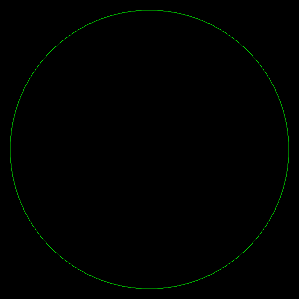

# 🛰️ Track Lookup – C++ Radar Sweep Simulator

**Track Lookup** is a simulation module written in modern C++ that emulates how a physical radar detects objects (tracks) as it rotates. The idea behind this project is simple but non-trivial: just like a real radar doesn’t "see everything at once", this system only detects a track when the sweep physically intersects it in both space and time.



---

## 🎯 What This Is About

This project was built to answer a core question:  
**Can we simulate a radar in a way that behaves like the real thing — both geometrically and temporally — without faking detections?**

The answer led to a component that:
- Rotates a beam in real-time
- Only "sees" objects when they're inside the cone
- Makes decisions based on angles, positions, and motion — not brute force scanning

It’s not just about displaying tracks, it’s about **knowing when they’d actually be visible** to a radar rotating at a given speed, with a defined beam width, and optional detection zones.

---

## ⚙️ How It Works

At the heart of the simulation is the `Radar` class. It maintains:

- A **sweep angle**, updated in real-time
- A configurable **beam width** (in degrees)
- A **position** (radar origin) and optional detection **polygon**
- A list of tracks, each of which is evaluated **only when the radar passes over them**

### Detection is based on:

- **Point-in-cone checks**: is the track inside the current angular sweep?
- **Point-in-polygon checks**: is the track inside the defined detection zone?
- **Visibility memory**: has the track already been detected in this sweep?

If all checks pass, the radar reports the track — just like a real radar pulse would.

---

## 🔍 Why This Was Hard

The hardest part wasn't the math — it was the **timing**.

Getting the radar to sweep at the correct speed (e.g. 360° in 4 seconds), and then **synchronizing detections** so they happen precisely when the beam reaches the track — not before, not after — required a fine balance of:

- Precision time tracking
- Angle normalization and wrapping
- Track state management
- Efficient geometric checks on every frame

You’re not looping through all tracks and faking hits — you’re behaving like hardware.

---

## 🧠 Under the Hood

Some key components:

- `Radar.h / Radar.cpp`  
  Implements the sweep logic, visibility checks, and interface.

- `Track.h / Track.cpp`  
  Manages incoming track data and stores internal state (e.g. last seen angle).

- `Math.h`  
  Handles geometry: point-in-cone, point-in-polygon, angle wrapping, etc.

- `Types.h`  
  Common structures like `Point`, `Angle`, etc.

- `HandledMessageKeys.h`  
  (Optional) Message key or field identifiers, likely used in integration.

---

## 🧪 Example (Simplified)

```cpp
if (radar.isTrackVisible(track.position())) {
    radar.reportDetection(track.id());
}

